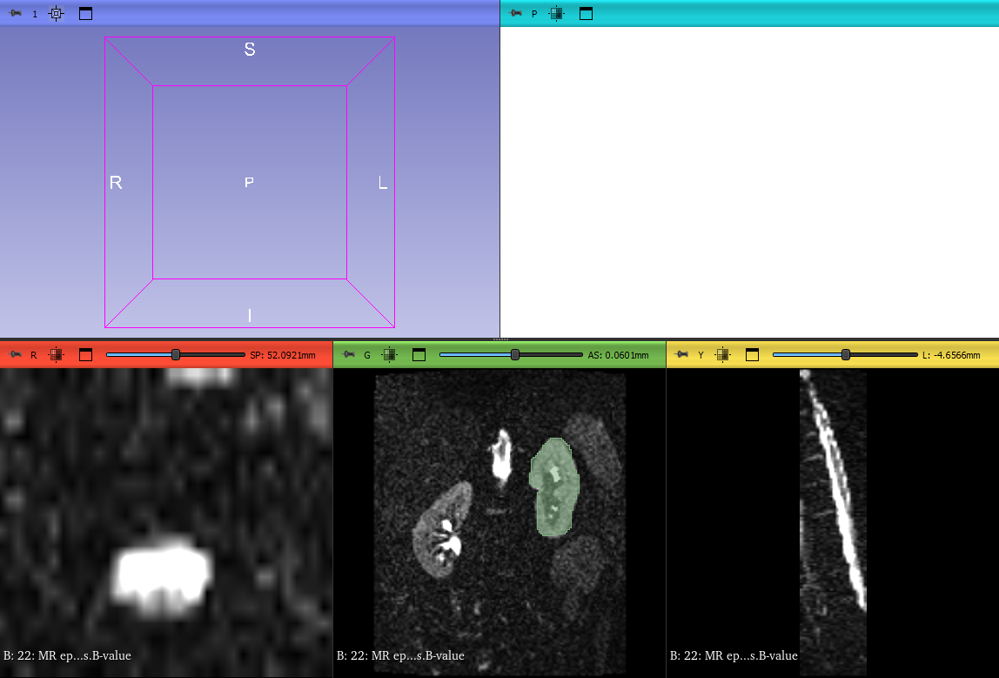
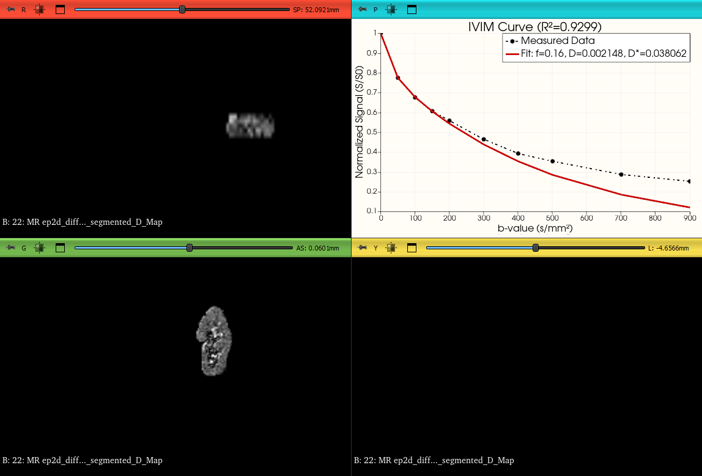

# IVIMfitSlicer: Advanced Diffusion MRI Analysis for 3D Slicer

**IVIMfitSlicer** is a comprehensive 3D Slicer extension designed for the robust analysis of Intravoxel Incoherent Motion (IVIM) Diffusion-Weighted Imaging (DWI) data. 

It integrates the power of the `ivimfit` Python library directly into the clinical workflow of 3D Slicer, offering both **voxel-wise parametric mapping** and **ROI-averaged statistical modeling** with advanced visualization capabilities.

> **Research Grade:** Designed for high-precision fitting using multiple algorithms, including Segmented, Free, Tri-exponential, and Bayesian models.

---

## 🌟 Key Features

### 1. Multi-Model Fitting Algorithms
* **Mono-Exponential (ADC):** Standard Apparent Diffusion Coefficient calculation.
* **Bi-Exponential (IVIM):**
    * **Segmented Fit:** Robust two-step estimation (High-b first, then Low-b) to separate diffusion ($D$) from perfusion ($f, D^*$). *Default threshold: $b=200$.*
    * **Free Fit:** Non-linear least squares fitting for all parameters simultaneously.
* **Tri-Exponential:** Advanced compartmental analysis for separating fast, intermediate, and slow diffusion components ($f_{fast}, f_{interm}, f_{slow}$).
* **Bayesian Inference:** (Optional) MCMC-based parameter estimation for high-precision ROI statistics.

### 2. Hybrid Analysis & Visualization
* **Simultaneous Output:** Generates both 3D parametric maps and numerical ROI statistics in a single run.
* **Smart Visualization:**
    * **Auto-Layout:** Automatically switches Slicer layout to "Four-Up Quantitative" to show maps and fitting plots side-by-side.
    * **Interactive Plotting:** Plots the Raw Signal vs. Fitted Curve with $R^2$ values and calculated parameters directly in the Slicer interface.
    * **Auto-Scaling:** Automatically scales diffusion maps ($\times 10^6$) and fractions ($\times 100$) to ensure optimal visibility and contrast.

### 3. Workflow Efficiency
* **Sequence & MultiVolume Support:** Seamlessly handles 4D datasets, including Sequence Nodes and MultiVolume nodes.
* **Standard Clinical Preset:** Includes a dedicated **"Load 10-Point Preset"** button to instantly apply standard b-values (`0, 50, 100, 150, 200, 300, 400, 500, 700, 900`) for rapid analysis setup.

---

## 🛠️ Installation

### Option 1: Via Slicer Extensions Manager
1.  Open 3D Slicer.
2.  Go to the **Extensions Manager**.
3.  Search for `IVIMfitSlicer` and install.

### Option 2: Manual Installation (Developer Mode)
1.  Clone or download this repository.
2.  Open 3D Slicer.
3.  Go to **Developer Tools** -> **Extension Wizard**.
4.  Click **Select Extension** and navigate to the `IVIMfitSlicer` folder.
5.  Ensure the module is checked and accept the restart if prompted.

---

## 🚀 Usage Workflow

### 1. Load Data
Import your DWI dataset (DICOM, NRRD, or Sequence) into 3D Slicer.

### 2. Define Region of Interest (ROI)
* Go to the **Segment Editor** module.
* Create a segmentation mask covering the tissue of interest (e.g., Tumor, Liver, Kidney).
* *Note: Analysis is strictly ROI-based to ensure computational efficiency and high SNR.*

### 3. Configure IVIMfitSlicer
* Switch to the **IVIMfitSlicer** module (under Diffusion category).
* **Input Image:** Select your DWI sequence.
* **ROI Mask:** Select the segmentation you created.
* **B-Values:** Enter b-values manually or click **"Load 10-Point Preset"** for quick configuration.
* **Algorithm:** Choose your desired model (e.g., `Bi-Exponential (Segmented)`).

### 4. Run Analysis
* Click **"Run Analysis & Plot"**.
* The module will:
    1.  Extract data from the ROI.
    2.  Perform voxel-wise fitting (generating maps).
    3.  Perform ROI-averaged fitting (generating statistics).
* You can change view layout and obsreve fitting curve with PlotCharts.    
---
### 🖼️ Workflow Gallery

  <strong>Step 1: Configuration (Main Window)</strong> 
  
   
  <em>Setting up inputs, ROI mask, and selecting the preset with Bi-Exponential Segmented model.</em>

  <strong>Step 2: Analysis Results (Maps & Plots)</strong> 
  
   
  <em> Generated Diffusion (D) Map (left) and the smooth ROI fitting curve with calculated parameters (bottom-right).</em>

---
---

## 🧮 Methodological Background

**IVIM Bi-Exponential Model:**
$$\frac{S(b)}{S_0} = f \cdot e^{-b D^*} + (1-f) \cdot e^{-b D}$$
* **$D$**: True diffusion coefficient (Slow component).
* **$D^*$**: Pseudo-diffusion coefficient (Fast/Perfusion component).
* **$f$**: Perfusion fraction.

**Tri-Exponential Model:**
$$\frac{S(b)}{S_0} = f_{fast} \cdot e^{-b D^*_{fast}} + f_{interm} \cdot e^{-b D^*_{interm}} + f_{slow} \cdot e^{-b D}$$
Useful for tissues with three distinct diffusion compartments.

---

## 🤝 Dependencies

This extension automatically manages the following Python dependencies:
* `ivimfit` (Core calculation engine)
* `numpy`, `scipy`
* `pydicom`

## 📄 License & Citation

**Author:** Atakan Isik (Baskent University)  
**License:** MIT License.
If you use this software in your research, please cite the associated repository or publication[10.36948/ijfmr.2025.v07i05.56036](https://doi.org/10.36948/ijfmr.2025.v07i05.56036).

---
*Developed for the Slicer Community.*